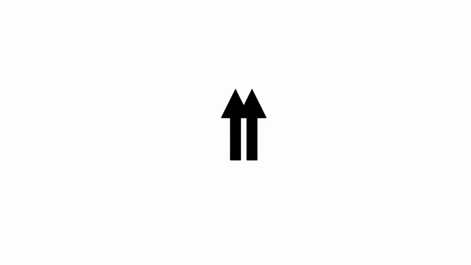

Hiya! I'm Adithya, a PhD student in Physics at Stanford University advised by <a href="https://scholar.google.com/citations?user=xXBlOUYAAAAJ&hl=en" target="_blank">Vedika Khemani</a>. Before this, I did my undergrad in physics and chemical engineering at Penn.

I'm really interested in statistical mechanics, randomness and applications of these ideas in classical and quantum error correction. I've recently thought a lot about <a href="https://arxiv.org/abs/2409.03325" target="_blank">applications specifically to topological quantum error correction</a>. Ideas from statistical mechanics and error correction also have a lot of relevance in machine learning and computation so I've recently begun exploring this area as well. 

Here's a <a href="{{base.url}}/assets/adithyasriram_cv-4.pdf" target="_blank">CV</a>.

## Publications

1. *Entanglement Oscillations from Many-Body Quantum Scars*  
N. O'Dea* and __A. Sriram*__.  
[<a href="https://arxiv.org/abs/2410.11822" target="_blank">arXiv (2024) </a>]

1. *Non-Uniform Noise Rates and Griffiths Phases in Topological Quantum Error Correction.*  
**A. Sriram**, N. O'Dea, Y. Li, T. Rakovszky, V. Khemani.  
[<a href="https://arxiv.org/abs/2409.03325" target="_blank">arXiv (2024) </a>]

1. *Topology, criticality, and dynamically generated qubits in a stochastic measurement-only Kitaev model.*  
**A. Sriram**, T. Rakovszky, V. Khemani, M. Ippoliti.  
[<a href="https://journals.aps.org/prb/abstract/10.1103/PhysRevB.108.094304" target="_blank">Physical Review B (2023) _Editor's Suggestion_</a>]

1. *Controlling the magnetic state of the proximate quantum spin liquid α-RuCl3 with an optical cavity.*  
E. V. Bostrom, **A. Sriram**, M. Claassen, A. Rubio.  
[<a href="https://www.nature.com/articles/s41524-023-01158-6" target="_blank">npj Computational Materials (2023)</a>]

1. *Light-induced control of magnetic phases in Kitaev quantum magnets.*  
**A. Sriram**, M. Claassen.  
[<a href="https://journals.aps.org/prresearch/abstract/10.1103/PhysRevResearch.4.L032036" target="_blank">Physical Review Research (2022)</a>]

1. *Graphene transistor arrays functionalized with genetically engineered antibody fragments for Lyme disease diagnosis.*   Z. Gao, P. Ducos, H. Ye, J. Zauberman, **A. Sriram**, X. Yang, M. W. Mitchell, D.
Lekkas, D. Brisson, A. T. C. Johnson.   [<a href="https://iopscience.iop.org/article/10.1088/2053-1583/ab5dce" target="_blank">2D Materials (2020)</a>]
  
1. *Attomolar detection of ss-DNA without amplification and capture of long target sequences with graphene biosensors.*   R. Vishnubhotla, **A. Sriram**, O. O. Dickens, S. V. Mandyam, J. Ping, E. Adu-Beng, A. T. C. Johnson.   [<a href="https://ieeexplore.ieee.org/ielaam/7361/9086908/8998161-aam.pdf" target="_blank">IEEE Sensors (2020)</a>]

## Misc.

I like to  <a href="https://www.mtecresults.com/runner/show?race=17889&rid=3811" target="_blank">run</a> a lot 🏃🏃🏃.

I've been playing the violin since I was seven. Here's a picture of me performing the Sibelius Violin Concerto recently. 

Someday maybe I'll post actual videos of my performances.

As one does in their 20s, I got into climbing. Here's me climbing outside for the first time when I was at <a href="https://boulderschool.yale.edu" target="_blank">the Boulder summer school</a> in 2023. 

It's mostly a replacement for when I used to be a tennis player. 

二年間前に日本語の勉強を始めた。まだ上手になれなくても楽しかった。これは日本語の授業から書いた<a href="{{base.url}}/assets/日本仏教.pdf" target="_blank">日本仏教</a>論文です.絶対たくさん間違いがあるかもしれないけどたくさん間違いがあるかもしれないけど面白い宿題だった。

I think stat mech is super cool. Here's an Ising model close to its critical point. There are clusters at all sizes!

Here's another fun animation I made.

### My favorite papers

Here are my favorite scientific papers. I'll add to this list as I see cool stuff!
* <a href="https://arxiv.org/abs/quant-ph/0110143" target="_blank">Topological quantum memory</a>
* <a href="https://arxiv.org/abs/1705.08975" target="_blank">Operator spreading in random unitary circuits</a>
* <a href="https://www.sciencedirect.com/science/article/abs/pii/0003491687900923" target="_blank">Statistical mechanics of neural networks near saturation</a>
* <a href="https://journals.aps.org/prb/abstract/10.1103/PhysRevB.51.6411" target="_blank">Critical behavior of random tranverse field Ising chains</a>

